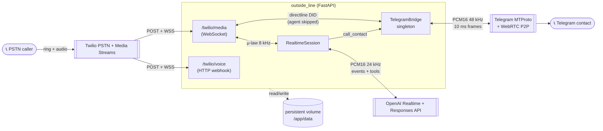

# outside-line

A self-hosted phone agent: callers dial a regular phone number, a
voice agent (OpenAI Realtime API) answers, converses, looks things up
on the web, answers questions grounded in an operator-authored case
brief, and can put the caller through to a hand-curated contact over a
Telegram voice call — or take a message for them.

Built for one concrete situation: keeping a person who can only place
outbound phone calls connected to the people who matter to them.



The full subsystem map is
[`docs/high-level-architecture.md`](./docs/high-level-architecture.md);
durable design decisions live in
[`docs/decisions/`](./docs/decisions/INDEX.md); day-2 operations in
[`docs/runbook.md`](./docs/runbook.md).

## Features

- **Live voice agent** on a real phone number (Twilio Media Streams ↔
  OpenAI Realtime, `gpt-realtime-2.1`), with a persona tuned for short,
  warm phone turns and a configurable name (`AGENT_NAME`).
- **Tools:** `search_web` (fresh info via the Responses API),
  `case_brief_lookup` (answers grounded in an operator-authored brief +
  optional court docket feed), `call_contact` / `message_contact`
  (bridge or message a curated contact over Telegram).
- **Directlines:** a dedicated DID per contact that connects the caller
  straight through — no agent in the path (ADR 0013).
- **Per-caller memory** merged after each call, an allow-list +
  DTMF-acceptance gate per caller, and a per-call report email.
- **Crash isolation:** the native Telegram voice stack runs in a
  supervised sidecar process; a SIGSEGV apologizes to the caller
  instead of taking the app down (ADR 0017).

## Lawful use & consent

This project connects real phone calls. Run it only on a phone line
you own, for callers who have consented to talk to your agent, and
know your local rules:

- **AI disclosure.** The persona doesn't volunteer that it's an AI but
  will confirm it plainly when asked, and never denies it. Some
  jurisdictions require proactive disclosure for automated calls —
  check yours and adjust `persona.py` if needed.
- **Recording is off by default** (`RECORDINGS_ENABLED=false`). Call
  recording is subject to one-party/two-party consent laws that vary
  by jurisdiction. If you enable it, the agent speaks a "this call may
  be recorded" notice to both legs first
  (`RECORDING_DISCLOSURE_ENABLED`, on by default) — disable that only
  if you have consent covered some other way.
- **The DTMF gate** exists because some carriers require the receiving
  party to press a digit to accept a call (and its charges). The
  account holder accepting charges on their own line is the intended
  use.

## Telegram terms-of-service caveat

The contact bridge automates a **user account** (Telethon + py-tgcalls
over MTProto), which is a gray area under Telegram's ToS — accounts
doing unusual automation can be limited or banned. Use a dedicated
account, warm it up, keep volume low (this design is single-digit
calls/day). The ToS-clean alternative is the Bot API or WhatsApp
Business — neither supports ringing a person's phone like a normal
call, which is why this project doesn't use them.

## Quickstart (local)

```bash
uv sync
cp .env.example .env        # fill in secrets
uv run uvicorn outside_line.main:app --reload
curl http://127.0.0.1:8000/healthz   # {"status":"ok"}
```

`ENVIRONMENT=development` (the default) boots with blank credentials;
anything else refuses to start until the hard-required keys are set.

Run the checks the CI runs: `uv run ruff check && uv run pytest -q`.

> The Python package is `outside_line` (underscore); the repo and the
> deployment target are `outside-line` (hyphen).

## Deploying for real

The reference deployment is Railway + Docker (`Dockerfile` in the
root; ADR 0001), but any host that gives you a public HTTPS domain and
a persistent disk works. The sequence:

1. **Accounts:** OpenAI (API key), Twilio (a voice-capable number +
   an **API Key SID/secret** and the **Auth Token** — both are
   required), Railway (or equivalent), Resend (optional, for the
   per-call report email), Telegram (optional, for the contact
   bridge: an `api_id`/`api_hash` from https://my.telegram.org/apps
   plus a dedicated account; `scripts/telegram_smoke_test.py` verifies
   the account can ring a contact before any real call depends on it).
2. **Warm the Telegram session** locally: `uv run python
   scripts/warm_account.py` — it asks for the OTP that arrives in the
   Telegram app on the phone that holds the agent account (2FA
   password too, if set).
3. **Provision the service** with a persistent volume mounted at
   `/app/data` (ADR 0004).
4. **Set the variables** from `.env.example` (hard-required block at
   minimum, plus `ENVIRONMENT=production`).
5. **Deploy** (on Railway: `railway up`).
6. **Set `PUBLIC_BASE_URL`** to the domain the host assigned, redeploy.
7. **Copy the Telegram session** to the volume
   (`data/sessions/outside-line.session`) if using the bridge.
8. **Point both Twilio webhooks at the app** (in the Twilio console) —
   voice → `POST {PUBLIC_BASE_URL}/twilio/voice`, status callback →
   `POST {PUBLIC_BASE_URL}/twilio/voice/status`. They must move in
   lockstep. (`scripts/dev_mode.py` automates the flip for the
   reference deployment.)
9. **Seed operator state:** `./scripts/callers.py add <your phone>`
   (unknown numbers are blocked by default),
   `./scripts/contacts.py add …` for bridge contacts, and optionally
   `data/case_brief/brief.md` (sample:
   [`docs/examples/case-brief.example.md`](./docs/examples/case-brief.example.md)).

Verify: `curl https://<domain>/healthz`, then a real call.

## Configuration

Every knob is an env var mapped 1:1 to
[`src/outside_line/config.py`](./src/outside_line/config.py), which
documents each one. [`.env.example`](./.env.example) lists them all,
grouped; the hub doc has the full table. Highlights:

| Variable | Default | What it does |
|---|---|---|
| `AGENT_NAME` | `Alex` | The name the agent answers to |
| `AGENT_TIMEZONE` | `America/New_York` | The agent's "today" |
| `TWILIO_AUTH_TOKEN` | — | Enables webhook signature validation; required in production |
| `RECORDINGS_ENABLED` | `false` | Dual-channel call recording (see consent notes above) |
| `DTMF_GATE_SECONDS` | `20` | Acceptance-gate pause; per-caller skip via `./scripts/callers.py skip-gate` |
| `CASE_BRIEF_PATH` / `CASE_BRIEF_DOCKET_FEED_URL` | brief-only | The grounded case-brief tool |
| `OPENAI_*` model knobs | see config | Every model is env-swappable without a redeploy (ADR 0024) |

Operator CLIs live in `scripts/` (`callers.py`, `contacts.py`,
`directlines.py`, `transcripts.py`, `archive.py`, `dev_mode.py`,
`add_contact.py`) — each has `--help`.

## Footguns

- **No volume = state loss.** Contacts, callers, memory, the Telegram
  session all live under `data/`; without a persistent mount every
  deploy wipes them (ADR 0004).
- **ntgcalls can SIGSEGV** on contact answer — that's why the Telegram
  stack runs in a supervised sidecar; don't import it into the web
  process (ADR 0017).
- **Outbound SMTP is blocked** on Railway's Hobby tier — the report
  email goes over Resend's HTTPS API, not SMTP (ADR 0005).
- **Deploys are manual** — a git push alone changes nothing in prod.

## Contributing

See [`CONTRIBUTING.md`](./CONTRIBUTING.md). License:
[MIT](./LICENSE).
