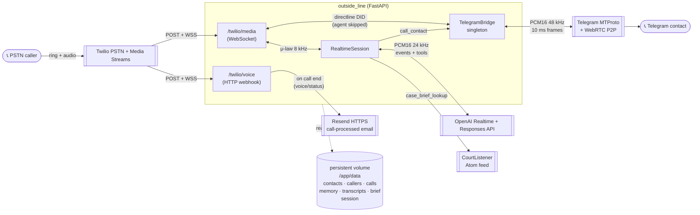
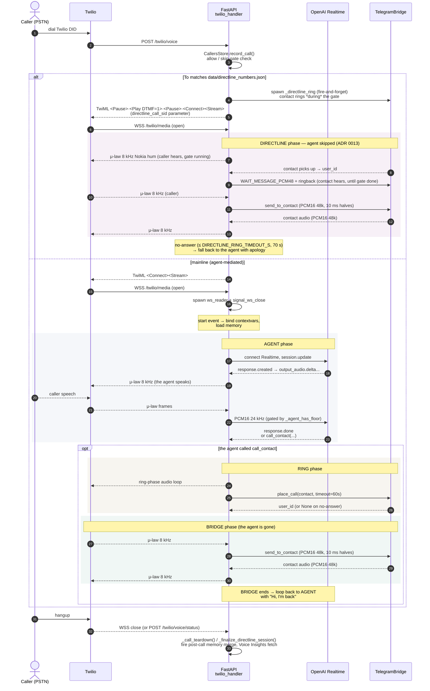

# outside-line — high-level architecture

> **What this is.** A hub map of every subsystem and how they fit
> together. Each section gives you the shape and the canonical entry
> point. The active backlog lives in [`docs/roadmap.md`](roadmap.md).
>
> For chronological "what shipped when," read `git log`.
> For named decisions, read [`docs/decisions/`](decisions/).

## TL;DR

outside-line is a voice agent reachable over PSTN at a dedicated
DID. Calls land at a Twilio number, stream μ-law audio over
a Media Streams WebSocket into a FastAPI app, get bridged into the OpenAI
Realtime API (`gpt-realtime-2.1`, voice `cedar`), and come back out the same
way. The agent (named via `AGENT_NAME`) speaks in a warm persona, can call
function tools (`search_web`, `case_brief_lookup`, `call_contact`,
`message_contact`), and on `call_contact` it hands the line off to an
outbound Telegram P2P voice call to a hand-curated contact. The whole thing
runs as one FastAPI process with a persistent `/app/data` volume for
operator state. The reference deployment is Railway, but any host with a
public HTTPS domain and a persistent disk works.

---

## 1. System at a glance



**Reading the diagram.** Solid arrows are live audio or per-call HTTPS;
dashed is persisted state. The four "lanes" are the moving parts: Twilio
(PSTN + media), our FastAPI brain (the only code we own), OpenAI (Realtime +
Responses), and Telegram (the outbound call path). Everything else is
auxiliary: Resend for the per-call call-processed email (sent on call-end),
CourtListener for the legal docket feed, the persistent volume for state
that has to survive deploys.

---

## 2. The inbound call lifecycle



**The phase loop.** `twilio_handler.media()` (in [`src/outside_line/twilio_handler.py`](../src/outside_line/twilio_handler.py))
is the orchestrator. After `SETUP` and `WAIT FOR start`, it inspects the
`start` event's parameters: if `directline_call_sid` is present, control
routes to `_run_directline_phase()` (same module)
— the agent-skip path (ADR 0013). Otherwise it runs the four-stage
mainline loop until the WebSocket closes:

- **AGENT** — `_run_agent_phase()` builds a fresh `RealtimeSession`, pumps
  caller audio into it, and waits for either the WS to close or the agent to set
  `bridge_request` via a `call_contact` tool call.
- **RING** — `_run_ring_phase()` plays a precomputed ring-phase audio
  loop (chosen by `settings.ring_audio_kind`: `hum` = Nokia-tune hum at
  `audio_bridge.NOKIA_HUM_ULAW_LOOP`, the default; `ringback` = legacy
  A4/C♯5/E5 arpeggio at `RINGBACK_ULAW_LOOP`) while awaiting
  `TelegramBridge.place_call(contact, timeout_s=60)`.
- **BRIDGE** — `_run_bridge_phase()` tears the Realtime session down
  entirely (ADR 0009 — "the agent surrenders the floor") and pumps audio directly
  Twilio ↔ Telegram. Exits on contact hangup, caller hangup, 30-min timeout,
  or the stall detector (`_stall_step` — tears down only when the bridge is
  silent in *both* directions; a live contact leg rides through a
  caller-inbound pause).
- **back to AGENT** — a fresh session is built with `first_response_instruction`
  set to "Hi, I'm back" or a no-answer apology that names the
  contact — "X, their &lt;relationship&gt;, didn't pick up…" from
  `_no_answer_instruction`.
  That hint is *one-shot* (it steers only the opening turn; the next turn runs
  on the persistent session instructions + history), so the contact's identity
  has to be *spoken* to survive into a retry turn.

`_call_teardown()` runs in the `finally` block: spawn post-call memory
merge, settle reader tasks, unbind structlog contextvars, close the WS.


---

## 3. The inbound path — Twilio, gating, recordings

Twilio is wired to the mainline DID via **API-Key auth** (`Client(api_key_sid,
api_key_secret, account_sid)`, not the Auth Token). The webhook is
`/twilio/voice`; X-Twilio-Signature validation runs whenever
`TWILIO_AUTH_TOKEN` is set (ADR 0010 has the threat model).
`voice(request)` (in [`twilio_handler.py`](../src/outside_line/twilio_handler.py))
parses the inbound POST, calls `CallersStore.record_call()`, then branches:

- **Not allowed** → `<Reject reason="busy"/>`. No WS opens. `voice()` records
  `received` + `blocked` to the call journal; the email fires later, on the
  terminal statusCallback (see below + ADR 0022) — no start-time alert. The
  blocked report still names the dialed line and carries the
  `./scripts/callers.py allow` triage.
- **`skip_gate=True`** → bare `<Connect><Stream/>` (no DTMF gate).
- **Default** → DTMF gate (lead/trail pause around the DTMF `1` controlled
  by `DTMF_GATE_SECONDS`, default 20s — accepts the carrier's "press 1
  to accept" prompt), then `<Stream/>`. The per-caller skip-gate flag is the
  only way to skip the wait; there is no URL-level toggle.

**Directline routing — dedicated DIDs that skip the agent.** If the dialed
Twilio number (`To`) matches an entry in
[`data/directline_numbers.json`](#11-where-things-live-on-disk), `voice()`
*additionally* spawns a contact-side ring task before returning TwiML —
so the Telegram contact's phone starts ringing while Twilio is still
rendering the gate's silent `<Pause>` blocks — and tags the stream with
`<Parameter name="directline_call_sid" .../>`. The WS handler reads that
param and routes into the directline phase: caller hears Nokia hum until
the contact answers, contact hears `WAIT_MESSAGE_PCM48_BYTES` (pre-rendered
wait phrase) + 48 kHz PCM ringback until the gate completes, then the
two are bridged with the agent fully out of the path. The agent only steps in if
the contact doesn't answer within `DIRECTLINE_RING_TIMEOUT_S` (70 s). The
allowlist still applies upstream (blocked callers can't dial a directline
to reach a contact). ADR 0013 records the race-model design.

**Call-end signal — `/twilio/voice/status`.** A second Twilio webhook
(`POST /twilio/voice/status`) fires once per call when `CallStatus` reaches a
terminal value. It does double duty:

1. **The call-processed report (ADR 0022)** — the single universal trigger
   for the per-call email; it fires for *every* end-state, and an atomic
   marker makes the send exactly-once across re-deliveries.
2. **Fast directline teardown (ADR 0013)** — when the caller hangs up during
   the gate (before the WS opens), this is the only signal that arrives in
   <1 s; the orphan-cleanup timer stays as backstop.

On WS open, `ws_reader()` consumes Twilio's framed JSON (one message per
20 ms μ-law frame). On the `start` event it binds `call_sid`, `stream_sid`,
`from_number`, `skip_gate` to structlog contextvars, optionally starts a
Twilio dual-channel recording, and loads per-caller memory from disk.


---

## 4. The brain — `RealtimeSession` + floor state

`RealtimeSession` ([`src/outside_line/realtime_agent.py`](../src/outside_line/realtime_agent.py))
owns the WS to OpenAI Realtime. It builds a fresh session per call — zero
module-level state, no cross-call leakage.

**Floor state — the load-bearing invariant.** Either the agent or the caller
holds the floor. The predicate is:

```python
def _agent_has_floor(self) -> bool:
    return (
        self._active_response_id is not None
        or bool(self._tool_tasks)
        or (self._playout is not None and self._playout.is_draining())
    )
```

`_active_response_id` is set on `response.created` and cleared on
`response.done`. `_tool_tasks` is populated when a function-call worker
spawns and auto-removed via `add_done_callback`. The third term is the
**playout tracker** (ADR 0020): `response.done` only means *generation*
finished — Twilio's buffer keeps playing the audio for up to tens of
seconds on long answers, and the floor must be held until the caller has
actually stopped *hearing* the agent. `PlayoutTracker`
([`src/outside_line/playout.py`](../src/outside_line/playout.py), one per media
WS, reset at each AGENT phase entry) arms a Twilio `mark` per audible
response; the mark's echo is the primary floor release (fail-closed), and
a byte-count clock (μ-law = 8 000 B/s) + `PLAYOUT_MARK_GRACE_S` bounds
the wait if an echo is lost. Each echo logs `echo_delta_ms` so the two
mechanisms audit each other on every call. So the agent holds the floor
whenever he is speaking, audibly draining, *or* a tool worker is running
on his behalf.

**Two layers of "no barge-in":**
1. **Server-side**: session config sets `turn_detection.interrupt_response:
   False` so the server won't interrupt itself even if PCM keeps arriving.
2. **Client-side**: `send_audio_pcm16()` drops caller PCM while
   `_agent_has_floor()` is true. Twilio frames are still consumed (the
   WebSocket stays healthy), but OpenAI's VAD never sees them, so no new
   turn commits. The muted-window ledger (`dropped_input_frames`) resets
   at `gate_reopened` — the first frame uploaded after the floor releases.

The other key event handlers: `_on_speech_started` (logs turn start),
empty-transcript nudge in `receive_loop` (when the caller-speech
transcription model returns `""`, inject a system message telling the agent
to ask the caller to repeat that, in the caller's language; the STT model is
`OPENAI_TRANSCRIPTION_MODEL`, `gpt-4o-transcribe` by default — ADR 0024),
and `__aexit__` (cancel + `asyncio.gather(return_exceptions=True)`
all in-flight tool tasks before closing the WS, so cancellations settle
before the WS dies and `session.closed` is the last line in the log).


---

## 5. The tools

Four function tools are registered on the Realtime session via
`session.update` and dispatched in `_run_tool()`:

| Tool | What it does | Model | External | Where | Gotcha |
|---|---|---|---|---|---|
| `search_web` | General-world questions (weather, news) | gpt-5.4-mini + hosted `web_search` (Responses API) | OpenAI | `tools/search.py` | Hosted `web_search` hangs from Realtime — delegated to Responses; strips citations to keep them out of TTS. Tuned for freshness (today's date + last-48h), `search_context_size:high`, prompt-steered source diversity, told-topics avoidance, honest-no-fake-fare (ADR 0024) |
| `case_brief_lookup` | Questions about the caller's legal case | gpt-5.4-mini (no tools, grounded prompt) | CourtListener Atom feed | `tools/case_brief.py` | Brief lives **only** on the data volume (gitignored). No `web_search` — facts only from brief + feed |
| `call_contact` | Hand off the call to a contact's Telegram | (dispatcher) | Telegram | `realtime_agent._run_tool` | Sets `bridge_request` + `bridge_request_event`; persona forbids naming Telegram aloud |
| `message_contact` | Send a Telegram text on the caller's behalf | (dispatcher) | Telegram | `tools/message_contact.py` | Same disambiguation pattern as `call_contact` ("which one?") |

All tool workers are spawned via `_spawn_tool_worker()`, stored in
`_tool_tasks`, and hold the floor until they post their result. Result
posting (`_post_tool_result`) creates a `function_call_output` item and
issues `response.create()` so the model auto-speaks an answer.

**Shared TTS hygiene** lives in [`tools/_speech.py`](../src/outside_line/tools/_speech.py):
`strip_citations()` scrubs the inline `([domain](https://…))` markdown
OpenAI keeps appending (would otherwise be read out character-by-character
by TTS), and `log_bridge_vocab_hits()` is a log-only regex post-filter that
warns when `search_web` / `case_brief_lookup` output leaks routing-mechanic
vocabulary (`bridge`, `patch in`, `conference in`, `transfer`,
`forward`, …). The persona rule in
[`persona.py`](../src/outside_line/persona.py) is the primary enforcement; the
post-filter is a passive regression guardrail.


---

## 6. The outbound Telegram path

> **Process-isolated since ADR 0017.** `TelegramBridge` (Telethon + py-tgcalls/
> ntgcalls) no longer runs in the FastAPI process — a native ntgcalls SIGSEGV
> took down all of prod on 2026-07-06. It now runs in a **supervised sidecar
> process** ([`telegram_sidecar.py`](../src/outside_line/telegram_sidecar.py)); the
> FastAPI process talks to it over two Unix-domain sockets (CONTROL + AUDIO) via
> a duck-typed **`TelegramBridgeClient`** ([`telegram_bridge_client.py`](../src/outside_line/telegram_bridge_client.py))
> exposed as `app.state.telegram_bridge`. A crash now costs one bridge attempt,
> not the server; the agent apologizes and can retry. FastAPI imports neither
> `pytgcalls` nor `telethon` anymore. See **§8** for the supervisor and the
> paragraph below for the in-sidecar bridge mechanics (unchanged).

`TelegramBridge` ([`src/outside_line/telegram_bridge.py:69`](../src/outside_line/telegram_bridge.py))
wraps **Telethon** (MTProto: auth, entity resolution, contacts) and
**py-tgcalls** (WebRTC: 1:1 P2P voice calls via the ntgcalls C++ binding). It is
constructed and hosted **inside the sidecar** (`_build_real_bridge`); the
mechanics below are unchanged, and only PCM48 frames + control RPCs cross the
socket ("mirror the bridge API" — resampling stays FastAPI-side, so ADR 0009's
framing invariant holds by construction).

The lifecycle:
- **Boot**: `TelegramBridge.start()` connects Telethon with a pre-warmed
  session at `data/sessions/outside-line.session` (created out-of-band via
  `scripts/warm_account.py` — OTP + 2FA), then `PyTgCalls.start()` boots
  the ntgcalls runtime. WebRTC is idle until a call is placed.
- **`place_call(contact)`**: `Telethon.get_entity(@username)` → `user_id`,
  then `pytgcalls.play(user_id, ExternalMedia.AUDIO, ...)`. Positive
  `user_id` branches MTProto to `phone.requestCall`, which rings the
  contact's Telegram app. Audio params are 48 kHz mono PCM16. Username-only
  resolution (ADR 0011) — phone lookup is unreliable for contacts who hide
  their number.
- **`send_to_contact(user_id, pcm48k, capture_time_ms)`**: feeds outbound
  frames via `send_frame(... Device.MICROPHONE ...)`. Critical framing
  rule: ntgcalls expects **10 ms granules** (480 samples / 960 bytes at
  48 kHz). Each 20 ms Twilio frame is split into two halves; submitting
  one 20 ms chunk gets silently truncated to the first 10 ms — the source
  of the 2× speed-up bug (fixed in ADR 0009).
- **Inbound**: `_on_stream_frame` callback fires from ntgcalls (~10 ms
  cadence) with contact's audio; `_on_chat_update` fires when the contact
  hangs up (sets `bridge_ended_event`).
- **`hangup(user_id)`** ends the WebRTC peer; MTProto signaling stays.
- **Shutdown**: `bridge.stop()` → `Telethon.disconnect()`. Session file
  survives on the volume.
- **Sidecar crash (ADR 0017)**: a native SIGSEGV drops the socket with no
  `LEFT_CALL`; the client synthesizes
  `on_bridge_ended(reason="sidecar_crashed")`, the caller hears one
  pre-rendered apology recording (`CRASH_MESSAGE_ULAW_BYTES` via
  `_play_ulaw_clip`), and the call ends — **no re-ring** (a re-ring hits the
  contact's lingering `CallBusy` and spams missed-call notifications). The
  native trace lands in `data/telegram_sidecar.faulthandler.log` and is
  re-logged by the supervisor. ADR 0017 has the full design.

→ Isolation design: ADR 0017.

---

## 7. The audio pipeline

Two codec chains, both in [`audio_bridge.py`](../src/outside_line/audio_bridge.py):

| Phase | Direction | Chain | Frame size | Why |
|---|---|---|---|---|
| **AGENT** | Twilio → OpenAI | μ-law 8 k → PCM16 24 k (soxr) | 20 ms | Realtime API expects PCM16 24 kHz |
| **AGENT** | OpenAI → Twilio | PCM16 24 k → apply_gain → μ-law 8 k | 20 ms | Twilio wants μ-law 8 k; gain is taste-tuned via `OPENAI_REALTIME_OUTPUT_GAIN` |
| **BRIDGE** | Twilio → Telegram | μ-law 8 k → PCM16 48 k (single soxr) | 20 ms in → 2 × 10 ms out | py-tgcalls 10 ms granule — stateless guarantees fixed 1920 B/frame (ADR 0014 records a rejected stateful attempt). |
| **BRIDGE** | Telegram → Twilio | PCM16 48 k → μ-law 8 k | callback-paced | ntgcalls cadence varies (ADR 0014 — stateful resampler tried, didn't move the artifact). |

μ-law encode/decode use precomputed LUTs (256-byte decode, 64 KB encode) so
codec conversion is O(1). Two ring-phase loops are synthesized once at
module import and selected by `settings.ring_audio_kind`:

- `NOKIA_HUM_ULAW_LOOP` (**default**, `hum`) — 13-note Tárrega "Gran
  Vals" fragment as a synthesised hum (fundamental + 2 harmonics + 5 Hz
  vibrato + breath noise + per-note ADSR), transposed −5 semitones at
  0.75× tempo, ≈5.16 s loop.
- `RINGBACK_ULAW_LOOP` (legacy, `ringback`) — major-third arpeggio
  (A4 → C♯5 → E5) + 3 s silence.

Both encode directly to frame-aligned μ-law for stride-without-bounds-check
playback by `_ring_audio_driver`. Flip via `RING_AUDIO_KIND` env var to
revert without a redeploy.

**Pre-rendered spoken clips** (checked in under
`src/outside_line/assets/`, loaded once at module import, no TTS on the call path):

- **Directline wait phrase** for the contact side (played on pickup before the
  gate completes): `WAIT_MESSAGE_PCM48_BYTES` from `directline_wait.raw`
  (48 kHz mono PCM16, for `send_to_contact`).
- **Crash recording** for the caller side (played on a sidecar SIGSEGV, then the
  call ends — ADR 0017): `CRASH_MESSAGE_ULAW_BYTES` from `crash_message.raw`
  (8 kHz mono μ-law, streamed to Twilio at 160 B / 20 ms).
- **Recording disclosure** for both legs ("This call may be recorded."),
  played only when `RECORDINGS_ENABLED` + `RECORDING_DISCLOSURE_ENABLED`
  are both on: `RECORDING_DISCLOSURE_{ULAW,PCM48}_BYTES` from
  `recording_disclosure_en_{ulaw8,pcm48}.raw`.

To regenerate either, run `./scripts/render_directline_audio.py` — it calls
OpenAI TTS and rewrites the asset in place; pass `--format ulaw8 --text … --out
…/crash_message.raw` for the caller-side μ-law clip (default `pcm48` renders
the directline phrase).


---

## 8. Process lifecycle — when things spawn and die

| Scope | Spawns | Lives until |
|---|---|---|
| **Dev-only supervisor** | `./scripts/dev_serve.py` spawns a supervised uvicorn under `--reload`, health-polls `/healthz`, and respawns on liveness loss (crash-loop guard: 5 respawns / 60 s → loud exit). | Operator `--stop`, crash-loop exit, host reboot |
| **Process boot** | FastAPI `lifespan` → `SidecarSupervisor.start()` (if `telegram_api_id` set; fail-open if not) spawns + connects the ntgcalls sidecar and exposes its `TelegramBridgeClient`. `Settings()` loads `.env` / Railway vars. structlog configured. | Uvicorn SIGTERM |
| **Bridge sidecar (ADR 0017)** | `SidecarSupervisor` spawns `python -m outside_line.telegram_sidecar`, health-pings it, and respawns on death (crash-loop guard → degraded mode: bridge calls raise, FastAPI keeps serving). | Supervisor `stop()`, crash-loop give-up |
| **Per call (WS open)** | `ws_reader`, `signal_ws_close` | WS close + `_call_teardown` cancels |
| **AGENT phase** | `RealtimeSession.__aenter__`, `pump_caller_audio`, `rt.receive_loop`, `req_task`, `closed_task` | Phase exits → `_settle_tasks` |
| **AGENT tools** | `_spawn_tool_worker(call_id, name, args)` | Worker posts result → done-callback removes from `_tool_tasks` |
| **RING phase** | `_ring_audio_driver`, `_drain_audio_inbound` | `place_call` returns (answer or timeout) |
| **BRIDGE phase** | `pump_to_telegram`, `ended_task`, `closed_task`, `timeout_task`, `stall_task`, `metrics_task` (1 Hz `phase.bridge.latency` emitter) | First task done → `_settle_tasks` cancels rest |
| **Fire-and-forget** (outlive the WS) | `maybe_update_memory`, `_fetch_voice_insights_summary` (retries at 30/60/120 s), Twilio recording start. NB the call-processed email (`craft_and_send_call_report`) is *not* here — it's spawned from the `/twilio/voice/status` request, not the WS (ADR 0022) | Network round-trip done, container restart, or process exit |
| **Process shutdown** | `SidecarSupervisor.stop()` → client stop + SIGTERM→SIGKILL the sidecar (which `Telethon.disconnect()`s) | Container exits; Railway restarts up to 10 times on failure |

The "fire-and-forget" row matters: any of these can be in flight when the
WS closes. They survive teardown but may not survive a container restart.
Memory merges in particular are best-effort by design.

---

## 9. Platform & ops

The reference deployment is Railway + Docker; any host with a public
HTTPS domain and a persistent disk works the same way.

- **Build**: explicit Dockerfile, Python 3.14, `uv` (ADR 0001). Layer cache
  on `pyproject.toml + uv.lock` first, then full project install.
- **Deploy**: **manual** (`railway up` on the reference deployment — no git
  trigger). Verify with `curl https://<your-app-domain>/healthz`.
- **Persistent volume**: `/app/data` (ADR 0004; 5 GiB allocated, kilobytes
  used). Everything in the table below lives there.
- **Secrets**: `.env` locally (gitignored), Railway variables in prod. Never
  committed. `.env.example` documents the shape.
- **Email is HTTPS, not SMTP**: Railway's Hobby tier closes outbound
  25/465/587, so the report email goes over Resend's HTTPS API; any
  HTTPS transactional-email API would do (ADR 0005).
- **Crash visibility**: the crash-prone ntgcalls code now runs in the
  sidecar (ADR 0017), which routes `faulthandler` to a durable file on the
  volume (`data/telegram_sidecar.faulthandler.log`) that survives the
  respawn; `SidecarSupervisor` tails new bytes into the host logs on child
  death. `main.py` still calls `faulthandler.enable()` as a backstop for any
  other native crash in the FastAPI process (which no longer imports
  pytgcalls/telethon). `/healthz` is wired as Railway's `healthcheckPath` in
  `railway.json` so the restart policy fires on liveness loss, not just on
  process exit. A native SIGSEGV in the FastAPI process should now be
  effectively impossible; the sidecar absorbs the ntgcalls one.
- **Simulate a sidecar crash**: `POST /debug/crash-sidecar` (gated by
  `SIDECAR_DEBUG_CRASH=1`; 404 in prod) SIGSEGVs the sidecar mid-call to
  verify FastAPI survives + the agent apologizes.
- **Dev-mode switcher** (`scripts/dev_mode.py`): two modes — `prod`
  (Twilio → the deployed app) and `local` (Twilio → a public tunnel such
  as ngrok + local uvicorn).
  Implemented as Twilio webhook URL changes, sweeping every
  managed DID carrying the app's friendly-name prefix — the
  **friendly-name convention** is mainline bare (`<prefix> mainline`)
  and directlines carry the routed-to contact's name
  (`<prefix> directline (Sam)`). To buy a new directline DID and add
  its contact, use `scripts/add_contact.py` (guided) or
  `scripts/directlines.py` + `scripts/contacts.py` directly. Each
  toggle flips BOTH the voice
  webhook (`/twilio/voice`) and the call-lifecycle webhook
  (`/twilio/voice/status`) in lockstep — pointing them at different
  hosts would always be a bug. No redeploy unless leaving `local`. The DTMF gate is always rendered server-side for allowed
  callers not flagged skip_gate (length = `DTMF_GATE_SECONDS`); the
  per-phone gate-skip list in `data/callers.json` is the only escape hatch.
- **Operator-CLI sync** (ADR 0006, `scripts/_sync.py`): mutating CLIs
  (`callers.py`, `contacts.py`, `directlines.py`) pull from `/app/data` via
  `railway ssh`, mutate locally, push back atomically (`cat > tmp.$$ && mv
  tmp.$$ final`). Accepted race window is documented; next mutating
  command picks up any clobbered update.


---

## 10. Configuration

Every knob is an env var mapped 1:1 to a field on
[`src/outside_line/config.py`](../src/outside_line/config.py)'s `Settings` —
that file is the source of truth, with a commented rationale per knob.
[`.env.example`](../.env.example) mirrors the full set, grouped, with the
hard-required block on top. The README carries a highlights table.

---

## 11. Where things live on disk

Everything under `data/` is gitignored. Everything in the table below is on
the persistent volume in prod.

| Path | Owner (writes) | Survives restart? | Survives redeploy? | How to mutate |
|---|---|---|---|---|
| `data/sessions/outside-line.session` | `scripts/warm_account.py` (one-shot OTP+2FA) | ✓ | ✓ | Re-run warm script if lost; not safely editable |
| `data/contacts.json` | Operator CLI `scripts/contacts.py` | ✓ | ✓ | `scripts/contacts.py add / update / forget` · `scripts/add_contact.py` for a new contact + its directline DID |
| `data/callers.json` | App `CallersStore.record_call` (per call) + operator CLI | ✓ | ✓ | `scripts/callers.py` (allow/skip-gate/label) |
| `data/directline_numbers.json` | Operator CLI `scripts/directlines.py` | ✓ | ✓ | `scripts/directlines.py add / remove / enable / disable / label` · `scripts/add_contact.py` buys + maps a new one |
| `data/memory/<E.164>.md` | App `maybe_update_memory` async task | ✓ | ✓ | `scripts/callers.py memory show/edit/set/clear` |
| `data/transcripts/<call_sid>.jsonl` | App `TranscriptWriter` (per turn) | ✓ | ✓ | Read-only via `scripts/transcripts.py` and `scripts/archive.py` |
| `data/calls/<call_sid>.jsonl` (+ `.emailed` marker) | App `CallJournal` (voice() + media() seams) | ✓ | ✓ | Read-only; feeds the call-processed report (ADR 0022) |
| `data/case_brief/brief.md` | Operator, edited by hand | ✓ | ✓ | Never in git |
| `.env` (secrets) | Local only, not on volume | n/a | n/a | Edit + reload; Railway uses dashboard vars instead |

---

## 12. Where to look next

- [`docs/decisions/INDEX.md`](decisions/INDEX.md) — every ADR in one
  table (number, title, date, status, one-liner). Open the indexed
  file for the full record. Cross-reference an ADR by its number
  (`ADR 0009`) elsewhere in the codebase.
- [`docs/roadmap.md`](roadmap.md) — the active backlog.
- [`docs/runbook.md`](runbook.md) — operate, pause, rotate, debug.
- [`.env.example`](../.env.example) — secret shape; copy + fill for local dev.
